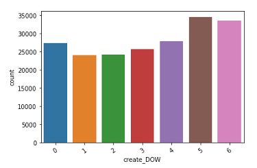
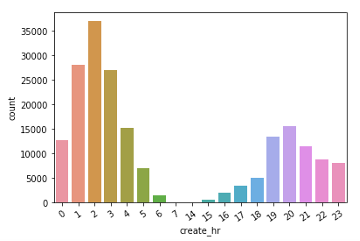
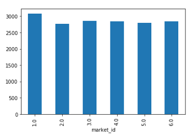
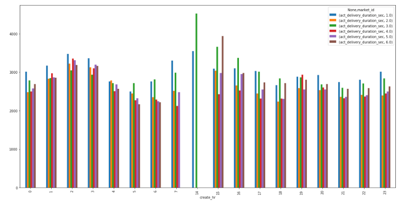
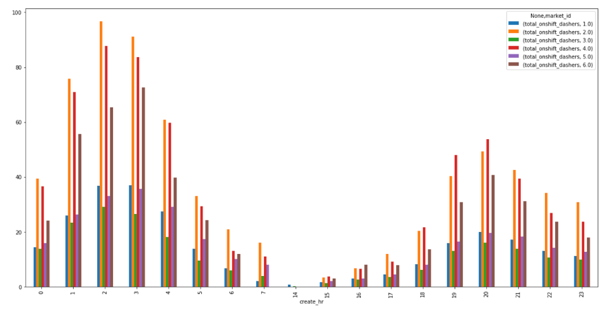

# Food Delivery Time Prediction

It is very important for food delivery company to get this right, as it has a big impact on consumer experience. Order lateness / underprediction of delivery time is of particular concern as past experiments suggest that underestimating delivery time is roughly twice as costly as overestimating it. Orders that are very early / late are also much worse than those that are only slightly early / late. In this project, I will build a model to predict the estimated time taken for a delivery.

The target of the project is predicting the total seconds value between ‘created_at’ and ‘actual_delivery_time’, which is also known as total delivery duration. In the following, the compelling insights and findings will be presented, and the results and error measurements from each model will be compared and displayed in the model session. Last, I will discuss the quality and reliability of the results. Conclusion and recommendations will be addressed, and I will also present areas that I could’ve improved in and how to predict future results.

## Data Processing

For this project, I’m provided a historical data contains a subset of deliveries received at DoorDash in early 2015 in a subset of the cities with 197428 records. Several columns from the dataset contain some missing values, after digging out the data, I decided to use different approaches to either fill up or drop the missing values for each column. For total_onshift_dashers, total_busy_dashers, and total_outstanding_orders, i fill up with the average value from the same market and created time, because I assumed that the number of the available dashers working within 10 miles of the store should be similar in the same created hour and region.
- market_id: I drop them
- actual_delivery_time: only 7 records, I drop them
- store_primary_category: I will ignore this column
- order_protocol: I will ignore this column
- total_onshift_dashers: fill up with the average total_onshift_dashers at same market id and created hour.
- total_busy_dashers: fill up with the average total_onshift_dashers at same market id and created hour.
- total_outstanding_orders: fill up with the average total_onshift_dashers at same market id and created hour.

Moreover, there were some values that were anomalous. Some columns contain negative values, which didn’t make sense. I simply make those negative numbers to 0. There are 3 outliers in actual delivery time. They took over 97 hours, so I remove those outliers as well. In addition, I created additional variables such as day of the week of creating time, the hour of creating time, actual delivery time in second to improve model performance. Also, recategorize some of the variables can help to check if a certain group is significant.

## EDA
First, I looked up the demand distribution, the result as below charts shown. 

The demands are variety by different markets, day of the week, and created hour. Markets 2 and 4 might be a bigger region which has more demand than other markets. Most of the orders are from the weekend. Demand is getting less from 5 am to 6 pm. The peak time for demand is 2 am. Second, I also examined if the delivery time varies by markets and created time. The result is below shown.

There are not vary by the markets. All markets have a similar pattern of delivery time. Market 1 and 3 seems to take longer time than other markets. The delivery time is very different at the time of creating the order, which also suggests the importance of the number of available drivers working in that period, so I plotted the average number of drivers working in different created hours. The result is below shown.

The answer is clearly explained by the chart. The longer delivery time periods are having fewer delivery drivers. The same situation happens to all the markets. These would be an important reference for the following forecasting models. The variables selection will be based on this information for some models.

## Models and Results

In this section, I’ve tried several different Machine Learning models such as Linear regression, KNN, Neural Network, and Random Forest. I’ll evaluate the performance and compare them. Based on the result I obtained from the EDA session and Linear Regression, there are some variables are significant and meaningful - market id, store id, created time, total items, subtotal, total on shift dashers, total_busy_dashers, total_outstanding_orders, the number of distinct item, and max/min item price will be considered in the models. The result as below table shown.

|       | MAE   |MAPE    |RMSE    |
|------------|-------------|-------------|-------------|
| Linear Regression Out-sample| 851.72|	0.3	| 1247.31     |
| Linear Regression In-sample | 847.24	| 0.31	| 1202.59|
| KNN Out-sample	|888.58|	0.3|1306.17|
| KNN In-sample	|649.06|	0.2|	1105.73|
| Random Forest Out-sample|	697.54| 0.27| 1057.63|
| Random Forest In-sample|	393.33|  0.15| 592.82|

I decided to focus on MAE, MAPE, and RMSE as three key error metrics to evaluate the performance of the models. In the final result, the Mean Absolute Error (MAE) is around 703 to 888, suggesting the average of the difference between delivery time estimates and the actual delivery time is around 697 seconds (11.6 mins) to 888 seconds (14.8 mins). The best model is the random forest, which includes the independent variables: market id, store id, created hour, total items, the total on shift dashers, total_busy_dashers, total_outstanding_orders, the number of distinct item, and max/min item price. In the created hour bin, we can easily observe how errors distributed into different time periods. The result as below table shown.

|   create_hr_bin	|out mae|	out mape|	out rmse|	in mae|	in mape|	in rmse|
|------------|-------------|-------------|-------------|-------------|-------------|-------------|
|0am-5am|	711.73|	0.26|	1063.95|	399.94|	0.14|	596.44|
|6am-3pm|	791.70|	0.33|	1100.52|	432.67|	0.18|	631.96|
|4pm-23pm|	675.20|	0.28|	1073.16|	381.57|	0.16|	584.94|

Most errors are from the demand created from 6pm – 3pm. At this period, the number of available drivers probably is more unstable and inadequate to process the demand, which makes the forecasting more challenging.

## Conclusion and Recommendation
In conclusion, after trying the multiple machine learning models, the random forest model was the most reliable model for this dataset. However, the model still has some flaws that can be improved. In this project, I’m predicting the actual total delivery duration, which means from the time the order created to the time the customer received the order. If I have more information, so I could break down the delivery time process into different stages and predict them separately. Then, add those times together to get the total delivery time, so the performance of forecasting might be improved. For example, there are many factors that affect the pick-up time, such as no parking spot, or difficulty of access to the building. For those potential issues, we can build a separate model to predict only pick-up time. We can do the same thing for driving time and drop-off time as well. Moreover, zip code and address of destination can be also included in the dataset, which shows a clearer and specific location. Ideally, we could connect with Google Maps or Apple Maps to better understand and update the up-to-date traffic conditions in order to capture the accurate driving time. Last but not least, the weather and temperature will also affect the delivery time sometimes. It would be helpful if that information can be included.

**Please don't be hesitate to contact me through LinkedIn or email if you're interested in this topic and have further questions. I'm willing to share and discuss more. Thank you for your time.**

